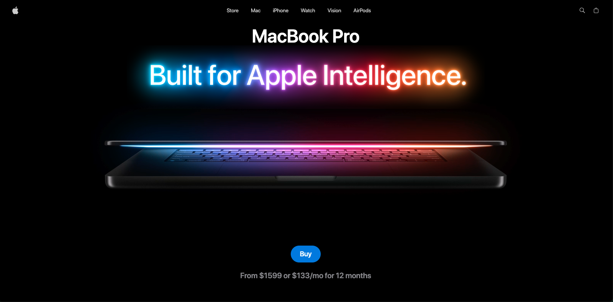

# 💻 MacBook GSAP Landing Page

An interactive and modern MacBook-inspired product landing page built with **React**, **Vite**, **Three.js**, **React Three Fiber**, **GSAP**, and **Tailwind CSS**. The project combines smooth animations with immersive 3D graphics to create a premium product showcase experience.


---

## 🚀 Live Demo

**🌐 [Visit the Live Demo](https://macbook-gsap-app-iota.vercel.app/)**
---

## 📸 Preview

<div align="center">
  
</div>


---

## ✨ Features

- 🎨 Modern Apple-inspired UI
- 💻 Interactive 3D MacBook model
- ⚡ Smooth GSAP-powered animations
- 📱 Fully responsive design
- 🎥 Scroll-based animations
- 🎯 High-performance rendering with React Three Fiber
- 🎨 Clean component-based architecture
- ⚙️ Fast development with Vite

---

## 🛠️ Built With

- React 19
- Vite
- Three.js
- React Three Fiber
- React Three Drei
- GSAP
- Tailwind CSS v4
- Zustand

---

## 📂 Project Structure

```
src/
├── components/
├── constants/
├── sections/
├── App.jsx
├── main.jsx
└── index.css

public/
├── fonts/
├── models/
├── textures/
└── images/
```

---

## ⚙️ Installation

Clone the repository

```bash
git clone https://github.com/Dsaar/macbook-gsap-app.git
```

Navigate into the project

```bash
cd macbook-gsap-app
```

Install dependencies

```bash
npm install
```

Start the development server

```bash
npm run dev
```

Build for production

```bash
npm run build
```

Preview the production build

```bash
npm run preview
```

---

## 🎯 What I Learned

While building this project, I gained hands-on experience with:

- Creating interactive 3D experiences using Three.js
- Building reusable React components
- Integrating GSAP animations into React
- Using React Three Fiber for rendering WebGL scenes
- Optimizing rendering performance
- Creating responsive layouts with Tailwind CSS
- Managing application state with Zustand

---

## 📈 Future Improvements

- Add dark/light theme support
- Improve accessibility
- Add loading animations
- Optimize 3D assets
- Add more product interaction
- Improve mobile performance

---

## 👨‍💻 Author

**Daniel Saar**

GitHub: https://github.com/Dsaar

LinkedIn: https://www.linkedin.com/in/daniel-josh-saar

Portfolio: https://danielsaar-portfolio.vercel.app

---

## 📄 License

This project is open source and available under the **MIT License**.